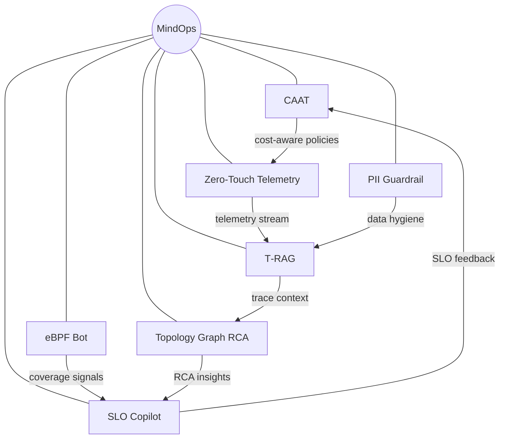

# MindOps

Welcome to **MindOps**, a collection of research‐driven projects exploring the future of
observability and autonomous operations.  Each project in this repository tackles a
specific challenge in modern cloud systems and proposes an innovative solution that
combines state–of–the–art instrumentation, machine learning and AI‐assisted
analysis.  Over time this repository will host multiple projects under the
MindOps umbrella.  The first project, described below, implements an
intelligent telemetry system called **Cost‑Aware Adaptive Telemetry (CAAT)**.

[Dominant Forces in AI,](https://www.linkedin.com/newsletters/dominant-forces-in-ai-7231479529104371712/) Subscribe Now to stay ahead with the latest in AI trends, innovations, and discussions.

## MindOps Constellation



## Projects

This repository follows a modular layout under the `projects/` directory.  Each
subdirectory contains a self‑contained project along with its code, deployment
scripts, documentation and examples.  A brief overview of the planned
projects is provided below.  Projects 1 through 4 are implemented at the moment;
the remaining projects are placeholders for future work.

| Project | Directory | Description | LinkedIn Deep Dive |
| --- | --- | --- | --- |
| 1 | [`projects/caat`](projects/caat) | **Cost‑Aware Adaptive Telemetry (CAAT)** – an intelligent observability stack that adjusts the level of logging, tracing and metrics collection in real time based on runtime context and budget constraints. [[Wiki]](https://github.com/Huzefaaa2/MindOps/wiki/Project-1-CAAT) | [Watch how CAAT reallocates observability spend in real time](https://www.linkedin.com/pulse/mindops-project-1-caat-cost-aware-adaptive-telemetry-edition-husain-ofgke) |
| 2 | [`projects/t‑rag`](projects/t-rag) | **Trace‑Native RAG for Root Cause** - T‑RAG tackles the next stage: rapid, AI‑assisted root cause analysis (RCA) using live traces, logs and metrics. [[Wiki]](https://github.com/Huzefaaa2/MindOps/wiki/Project-2-T-RAG) | [See trace‑native RAG turn signals into fast RCA](https://www.linkedin.com/pulse/mindops-project-2-trag-tracenative-rag-root-cause-edition-husain-vcklf) |
| 3 | [`projects/ebpf‑bot`](projects/ebpf-bot) | **eBPF Coverage Bot** – Project 3 adds full observability to the ebpf-bot system by integrating OpenTelemetry-based tracing, metrics, and logging across its core modules. It captures spans for major operations like signal ingestion, processing, coverage decisions, and orchestrator logic, enhancing them with meaningful attributes and error events. Metrics such as decision counts and processing latency are emitted and exposed via Prometheus, while structured logs include trace and span correlation for streamlined debugging. The setup is fully containerized with Docker Compose, supporting Jaeger, Prometheus, and Grafana for visualization and analysis. [[Wiki]](https://github.com/Huzefaaa2/MindOps/wiki/Project-3-eBPF-Bot) | [Watch the coverage loop close with end‑to‑end telemetry](https://www.linkedin.com/pulse/mindops-project-3-ebpf-coverage-bot-completing-loop-huzefa-husain-rtdaf) |
| 4 | `projects/slo‑copilot` | **SLO Copilot + Trace‑Based Testing** – generates SLOs from trace baselines, runs trace-driven tests, and emits guardrail snippets. Integrates with CAAT, T‑RAG, and eBPF Bot. [[Wiki]](https://github.com/Huzefaaa2/MindOps/wiki/Project-4-SLO-Copilot) | — |
| 5 | `projects/zero‑touch‑telemetry` | **Zero‑Touch Telemetry for Kubernetes** – coming soon. [[Wiki]](https://github.com/Huzefaaa2/MindOps/wiki/Project-5-Zero-Touch-Telemetry) | — |
| 6 | `projects/pii‑guardrail` | **PII Guardrail Pre‑Ingest** – coming soon. [[Wiki]](https://github.com/Huzefaaa2/MindOps/wiki/Project-6-PII-Guardrail) | — |
| 7 | `projects/topology‑graph‑rca` | **Topology Graph RCA Engine** – coming soon. [[Wiki]](https://github.com/Huzefaaa2/MindOps/wiki/Project-7-Topology-Graph-RCA) | — |

## Contributing

We welcome contributions!  Please read the contribution guidelines in
[`docs/contributing.md`](docs/contributing.md) for instructions on how to submit
bug fixes, feature requests or new components.  Each project directory
contains its own build and deployment instructions.

## Project 4 Demo (SLO Copilot)

Quick demo that runs CAAT + eBPF coverage, exports SLOs, and evaluates the deployment gate:

```bash
PYTHONPATH=projects/slo-copilot/src python3 -m slo_copilot.demo_all_cli \
  --trace projects/slo-copilot/examples/sample_trace.json \
  --telemetry-volume 0.9 \
  --telemetry-volume 1.1
```

[Dominant Forces in AI,](https://www.linkedin.com/newsletters/dominant-forces-in-ai-7231479529104371712/) Subscribe Now to stay ahead with the latest in AI trends, innovations, and discussions.

## License

This repository is licensed under the MIT License.  See
[`LICENSE`](LICENSE) for details.

## Wiki
[MindOps Wiki](https://github.com/Huzefaaa2/MindOps/wiki)
