# MindOps

Welcome to **MindOps**, a collection of research‐driven projects exploring the future of
observability and autonomous operations.  Each project in this repository tackles a
specific challenge in modern cloud systems and proposes an innovative solution that
combines state–of–the–art instrumentation, machine learning and AI‐assisted
analysis.  Over time this repository will host multiple projects under the
MindOps umbrella.  The first project, described below, implements an
intelligent telemetry system called **Cost‑Aware Adaptive Telemetry (CAAT)**.
### 🎥 MindOps Architecture Walkthrough (Video)

Watch the visual breakdown of how the **7 MindOps projects** come together into a **cognitive operating system**:  
👉 https://www.linkedin.com/feed/update/urn:li:ugcPost:7424513621050732544

[Dominant Forces in AI,](https://www.linkedin.com/newsletters/dominant-forces-in-ai-7231479529104371712/) Subscribe Now to stay ahead with the latest in AI trends, innovations, and discussions.

## Why MindOps exists (the problem)

Modern enterprises run dozens to hundreds of microservices across multiple clouds. Observability
data is exploding in volume, yet reliability teams still struggle with:

- **Telemetry overload**: too much data, too little signal.
- **Slow RCA**: incident resolution depends on manual correlation across logs, traces, and metrics.
- **Cost uncertainty**: tracing/logging cost spikes during incidents.
- **Compliance risk**: sensitive data leaks into observability pipelines.
- **Fragmented tooling**: teams stitch together multiple platforms with no unified control plane.

MindOps solves this by treating observability as an **adaptive, intelligent system** that continuously
learns, optimizes cost, and guides operators toward the most likely root causes.

## What’s unique about MindOps

| Unique capability | Why it matters |
| --- | --- |
| **Closed‑loop observability** | Decisions (sampling, probes, SLOs) feed back into collection in real time. |
| **Trace‑native intelligence** | Root cause analysis uses real traces as first‑class context, not just docs. |
| **Cost‑aware policies** | Telemetry budget engine + RL policy keeps spend under control. |
| **Security & privacy guardrails** | PII is scrubbed before data reaches downstream systems. |
| **Composable constellation** | Each project is modular but designed to interoperate. |

## How MindOps works (end‑to‑end)


## Where MindOps fits in the ecosystem

| Layer | MindOps role | Example integrations |
| --- | --- | --- |
| **Instrumentation** | Auto‑discovers + configures OTEL collectors | OpenTelemetry, eBPF |
| **Observability** | Feeds traces/logs/metrics to backends | Jaeger, Prometheus, Grafana |
| **AI/RCA** | Synthesizes telemetry into RCA reports | OpenAI models, vector stores |
| **Governance** | Enforces SLOs + redacts PII | CI gates, SIEMs |

## How enterprises can use MindOps

- **SRE/Platform teams**: run Zero‑Touch Telemetry to auto‑wire instrumentation.
- **Reliability teams**: use SLO Copilot to define testable objectives.
- **Incident response**: run T‑RAG + Topology RCA for faster root cause.
- **Finance/Ops**: apply CAAT to control telemetry spend without losing signal.
- **Security/Compliance**: add PII Guardrail before telemetry leaves the cluster.

## Why enterprises adopt MindOps

| Outcome | Impact |
| --- | --- |
| Faster MTTR | RCA suggestions grounded in traces and topology |
| Lower observability cost | Sampling and budgeting automate spend control |
| Better coverage | eBPF bot ensures instrumentation gaps are closed |
| Safer data | Pre‑ingest redaction reduces privacy risk |
| Unified tooling | One constellation vs many disconnected systems |

## Enterprise readiness pack

- **MindOps Control Plane API**: lightweight gateway for policy changes, SLO export/validation, and RCA queries. See `projects/mindops-control-plane`.
- **Enterprise Day‑Zero Demo Pack**: prebuilt dashboards, SLOs, synthetic incident, and RCA output. See `demos/enterprise-day-zero`.
- **Data‑Flow Security Model**: PII scrubbing points + egress model. See `docs/security/data_flow_security.md`.
- **Enterprise Adoption Guide**: phased rollout plan and operating model. See `docs/enterprise_adoption_guide.md`.

## Detailed system flow (end‑to‑end)

```mermaid
flowchart TB
  subgraph Runtime["Runtime + Signals"]
    Workloads[Microservices/Apps]
    Kernel[eBPF Probes]
    SDKs[OTEL SDKs]
  end

  subgraph Collect["Collection + Control"]
    ZTT[Zero‑Touch Telemetry]
    OTEL[OTEL Collectors]
    Budget[Telemetry Budget Engine]
    RL[RL Policy Optimizer]
  end

  subgraph Intelligence["Reasoning + RCA"]
    TRAG[T‑RAG RCA]
    Topo[Topology Graph RCA]
    SLO[SLO Copilot]
  end

  subgraph Governance["Governance + Safety"]
    PII[PII Guardrail]
    Gate[CI / Guardrail Gates]
  end

  Workloads --> SDKs --> ZTT --> OTEL
  Kernel --> OTEL
  OTEL --> Budget --> RL --> OTEL
  OTEL --> PII --> TRAG
  OTEL --> Topo --> TRAG
  OTEL --> SLO --> Gate
  SLO --> RL

  classDef runtime fill:#E3F2FD,stroke:#1565C0,color:#0D47A1;
  classDef collect fill:#E8F5E9,stroke:#2E7D32,color:#1B5E20;
  classDef intel fill:#FFF3E0,stroke:#EF6C00,color:#E65100;
  classDef gov fill:#FCE4EC,stroke:#C2185B,color:#880E4F;
  class Workloads,Kernel,SDKs runtime;
  class ZTT,OTEL,Budget,RL collect;
  class TRAG,Topo,SLO intel;
  class PII,Gate gov;
```



## MindOps Constellation

```mermaid
flowchart TB
  Core((MindOps))

  P1[CAAT]
  P2[T‑RAG]
  P3[eBPF Bot]
  P4[SLO Copilot]
  P5[Zero‑Touch Telemetry]
  P6[PII Guardrail]
  P7[Topology Graph RCA]

  Core --- P1
  Core --- P2
  Core --- P3
  Core --- P4
  Core --- P5
  Core --- P6
  Core --- P7

  P1 -- cost‑aware policies --> P5
  P2 -- trace context --> P7
  P3 -- coverage signals --> P4
  P4 -- SLO feedback --> P1
  P5 -- telemetry stream --> P2
  P6 -- data hygiene --> P2
  P7 -- RCA insights --> P4
```



## Projects

This repository follows a modular layout under the `projects/` directory.  Each
subdirectory contains a self‑contained project along with its code, deployment
scripts, documentation and examples.  A brief overview of the planned
projects is provided below.  Projects 1 through 7 are implemented at the moment;
the remaining projects are placeholders for future work.

| Project | Directory | Description | LinkedIn Deep Dive |
| --- | --- | --- | --- |
| 1 | [`projects/caat`](projects/caat) | **Cost‑Aware Adaptive Telemetry (CAAT)** – an intelligent observability stack that adjusts the level of logging, tracing and metrics collection in real time based on runtime context and budget constraints. [[Wiki]](https://github.com/Huzefaaa2/MindOps/wiki/Project-1-CAAT) | [Watch how CAAT reallocates observability spend in real time](https://www.linkedin.com/pulse/mindops-project-1-caat-cost-aware-adaptive-telemetry-edition-husain-ofgke) |
| 2 | [`projects/t‑rag`](projects/t-rag) | **Trace‑Native RAG for Root Cause** - T‑RAG tackles the next stage: rapid, AI‑assisted root cause analysis (RCA) using live traces, logs and metrics. [[Wiki]](https://github.com/Huzefaaa2/MindOps/wiki/Project-2-T-RAG) | [See trace‑native RAG turn signals into fast RCA](https://www.linkedin.com/pulse/mindops-project-2-trag-tracenative-rag-root-cause-edition-husain-vcklf) |
| 3 | [`projects/ebpf‑bot`](projects/ebpf-bot) | **eBPF Coverage Bot** – Project 3 adds full observability to the ebpf-bot system by integrating OpenTelemetry-based tracing, metrics, and logging across its core modules. It captures spans for major operations like signal ingestion, processing, coverage decisions, and orchestrator logic, enhancing them with meaningful attributes and error events. Metrics such as decision counts and processing latency are emitted and exposed via Prometheus, while structured logs include trace and span correlation for streamlined debugging. The setup is fully containerized with Docker Compose, supporting Jaeger, Prometheus, and Grafana for visualization and analysis. [[Wiki]](https://github.com/Huzefaaa2/MindOps/wiki/Project-3-eBPF-Bot) | [Watch the coverage loop close with end‑to‑end telemetry](https://www.linkedin.com/pulse/mindops-project-3-ebpf-coverage-bot-completing-loop-huzefa-husain-rtdaf) |
| 4 | [`projects/slo‑copilot`](projects/slo-copilot) | **SLO Copilot + Trace‑Based Testing** – generates SLOs from trace baselines, runs trace‑based fault tests, emits guardrail policies, and exports OpenSLO (JSON/YAML). Integrates with CAAT, T‑RAG, and eBPF Bot. [[Wiki]](https://github.com/Huzefaaa2/MindOps/wiki/Project-4-SLO-Copilot) | — |
| 5 | [`projects/zero‑touch‑telemetry`](projects/zero-touch-telemetry) | **Zero‑Touch Telemetry for Kubernetes** – discovers workloads from manifests, plans collector topology (gateway/daemonset/sidecar), and emits OTEL configs plus patch hints. [[Wiki]](https://github.com/Huzefaaa2/MindOps/wiki/Project-5-Zero-Touch-Telemetry) | — |
| 6 | [`projects/pii‑guardrail`](projects/pii-guardrail) | **PII Guardrail Pre‑Ingest** – detects and redacts PII in logs and traces, emits redaction reports, and protects telemetry before export. [[Wiki]](https://github.com/Huzefaaa2/MindOps/wiki/Project-6-PII-Guardrail) | — |
| 7 | [`projects/topology‑graph‑rca`](projects/topology-graph-rca) | **Topology Graph RCA Engine** – builds a service dependency graph from manifests + traces, runs graph analytics, and surfaces RCA hints. [[Wiki]](https://github.com/Huzefaaa2/MindOps/wiki/Project-7-Topology-Graph-RCA) | — |

## Contributing

We welcome contributions!  Please read the contribution guidelines in
[`docs/contributing.md`](docs/contributing.md) for instructions on how to submit
bug fixes, feature requests or new components.  Each project directory
contains its own build and deployment instructions.

## Project 4 Demo (SLO Copilot)

Quick demo that runs CAAT + eBPF coverage, exports SLOs, and evaluates the deployment gate:

```bash
PYTHONPATH=projects/slo-copilot/src python3 -m slo_copilot.demo_all_cli \
  --trace projects/slo-copilot/examples/sample_trace.json \
  --telemetry-volume 0.9 \
  --telemetry-volume 1.1
```

## MindOps Orchestrator CLI

Run CAAT + SLO Copilot + Zero‑Touch + T‑RAG flows in one command:

```bash
PYTHONPATH=projects/mindops-orchestrator/src python3 -m mindops_orchestrator.cli \
  --trace projects/slo-copilot/examples/sample_trace.json \
  --manifests projects/zero-touch-telemetry/examples/sample_k8s.yaml \
  --telemetry-volume 0.9 \
  --telemetry-volume 1.1
```

Export a structured report bundle:

```bash
PYTHONPATH=projects/mindops-orchestrator/src python3 -m mindops_orchestrator.cli \
  --trace projects/slo-copilot/examples/sample_trace.json \
  --manifests projects/zero-touch-telemetry/examples/sample_k8s.yaml \
  --export-dir out
```

## MindOps Control Plane API

One gateway service to query or update policies, export SLOs, and run RCA.

```bash
python3 -m venv .venv
source .venv/bin/activate
pip install -r projects/mindops-control-plane/requirements.txt

PYTHONPATH=projects/mindops-control-plane/src python3 -m mindops_control_plane.app
```

Example calls:

```bash
curl -s http://localhost:8088/health
curl -s http://localhost:8088/slo/export
curl -s -X POST http://localhost:8088/policy/sampling \
  -H 'Content-Type: application/json' \
  -d '{"sampling_action":"decrease_sampling"}'
```

## Enterprise Day‑Zero Demo Pack

Run the end‑to‑end demo pack with prebuilt SLOs, a synthetic incident, and a sample dashboard:

```bash
cd demos/enterprise-day-zero
cat README.md
```

[Dominant Forces in AI,](https://www.linkedin.com/newsletters/dominant-forces-in-ai-7231479529104371712/) Subscribe Now to stay ahead with the latest in AI trends, innovations, and discussions.

## License

This repository is licensed under the MIT License.  See
[`LICENSE`](LICENSE) for details.

## Wiki
[MindOps Wiki](https://github.com/Huzefaaa2/MindOps/wiki)
