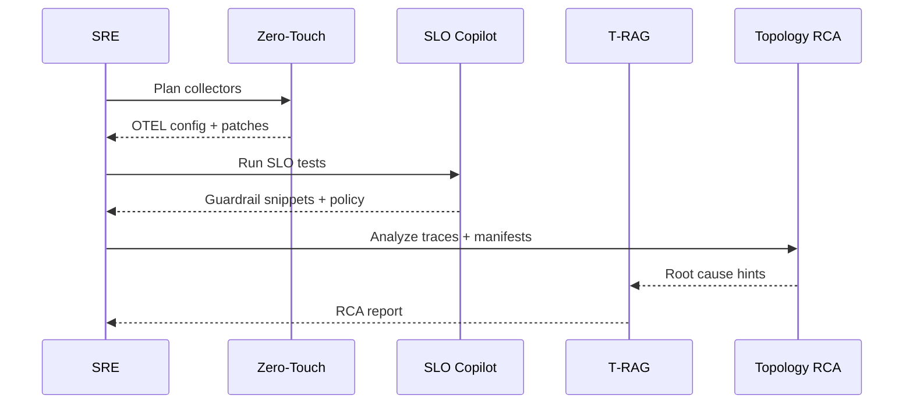

# Enterprise Day‑Zero Demo Pack

This demo pack gives an end‑to‑end “day‑zero” scenario for MindOps. It includes
prebuilt dashboards, SLOs, a synthetic incident, sample RCA output, and optional
control-plane calls.

## What’s inside

| Artifact | Path | Description |
| --- | --- | --- |
| Sample manifests | `manifests/` | K8s workloads for Zero‑Touch planning |
| SLO export | `assets/slo_export.json` | Baseline SLO definitions |
| OpenSLO bundle | `assets/openslo_bundle.json` | OpenSLO resources for SLO Copilot |
| Synthetic incident | `assets/incident.md` | Incident narrative + steps |
| RCA output | `assets/rca_output.json` | Example RCA result |
| Dashboard | `grafana/mindops-overview.json` | Grafana dashboard template |
| OTEL configs | `otel/` | Collector gateway + daemonset samples |
| Synthetic traces | `synthetic/` | Trace generator script |

## Quickstart

```bash
# 1) Generate a Zero‑Touch plan
PYTHONPATH=projects/zero-touch-telemetry/src python3 -m zero_touch_telemetry.cli \
  --manifests demos/enterprise-day-zero/manifests/sample_k8s.yaml \
  --mode auto \
  --output-dir demos/enterprise-day-zero/out

# 2) Run SLO Copilot
PYTHONPATH=projects/slo-copilot/src python3 -m slo_copilot.demo_all_cli \
  --trace projects/slo-copilot/examples/sample_trace.json \
  --telemetry-volume 0.9 \
  --telemetry-volume 1.1

# 3) Run Topology RCA
PYTHONPATH=projects/topology-graph-rca/src python3 -m topology_graph_rca.cli \
  --manifests demos/enterprise-day-zero/manifests/sample_k8s.yaml \
  --traces projects/topology-graph-rca/examples/sample_trace.json \
  --output demos/enterprise-day-zero/out/topology_report.json \
  --render-svg demos/enterprise-day-zero/out/topology_graph

# 4) Optional: query via the control plane API
PYTHONPATH=projects/mindops-control-plane/src python3 -m mindops_control_plane.app
curl -s http://localhost:8088/slo/export | jq .

# 5) Optional: generate synthetic traces
python3 demos/enterprise-day-zero/synthetic/generate_traces.py \
  --output-dir demos/enterprise-day-zero/out \
  --format both
```

## Demo flow


