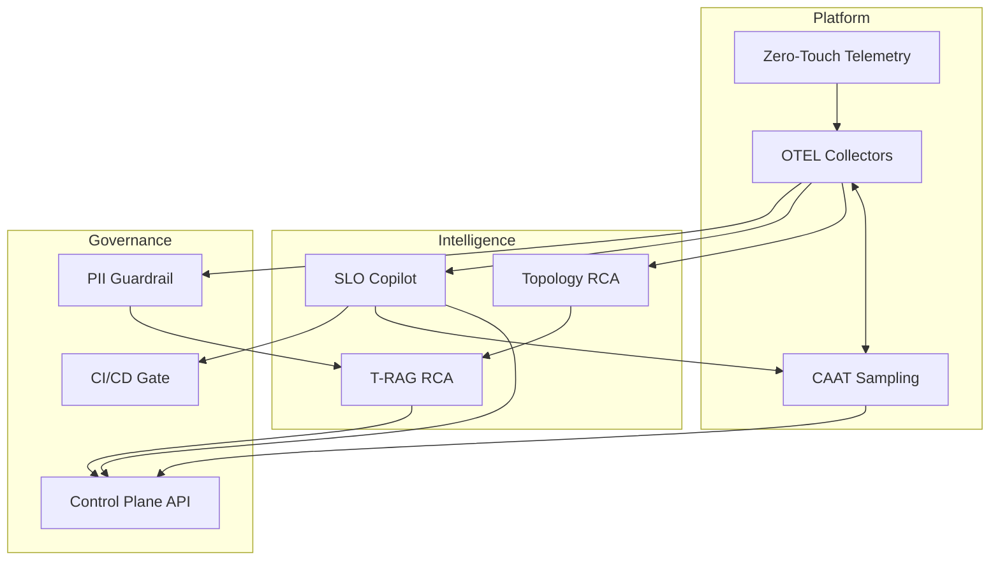

# MindOps Enterprise Adoption Guide

This guide describes how to adopt MindOps in phases, the teams involved, and the
operational practices that make the system durable and enterprise-ready.

## 1) Adoption phases

| Phase | Timeline | Primary outcomes | Key MindOps components |
| --- | --- | --- | --- |
| Day 0 (Pilot) | Week 1-2 | Baseline telemetry + SLOs | Zero-Touch, SLO Copilot |
| Day 30 (Stabilize) | Week 3-6 | RCA acceleration + cost control | T-RAG, CAAT |
| Day 90 (Scale) | Week 7-12 | Full governance + feedback loops | Guardrails, Topology RCA |

## 2) Reference architecture

## 3) RACI (roles and responsibilities)

| Activity | Platform | SRE | Security | App Teams |
| --- | --- | --- | --- | --- |
| Deploy OTEL + Zero-Touch | R | C | C | I |
| Define SLOs | C | R | I | C |
| RCA triage | I | R | I | C |
| Policy changes | C | R | C | I |
| PII redaction rules | I | C | R | I |

R = Responsible, C = Consulted, I = Informed

## 4) Success metrics

| Metric | Target | Why it matters |
| --- | --- | --- |
| MTTR reduction | 30-50% | Faster RCA via trace + topology insights |
| Telemetry spend | -20% | CAAT keeps cost predictable |
| SLO compliance | +10% | Clear guardrails + testable objectives |
| Coverage gaps | -50% | eBPF bot + Zero-Touch auto-instrument |

## 5) Operational checklist

| Area | Checklist |
| --- | --- |
| Security | TLS enabled, RBAC enforced, audit logs collected |
| Reliability | OTEL collectors in HA mode, retry policies |
| Cost | Sampling policies tuned, budget alerts defined |
| Compliance | PII scrubbing rules validated |
| Change control | CI gate enabled for SLO guardrails |

## 6) Pilot runbook (short)

1. Run Zero-Touch in plan mode against staging manifests.
2. Apply OTEL collector plan and validate signals.
3. Generate baseline SLOs with SLO Copilot.
4. Simulate an incident and validate RCA output.
5. Enable CAAT policy changes after cost baseline is established.

## 7) Enterprise integration points

- Export OpenSLO bundles to governance systems.
- Feed RCA summaries to incident management.
- Push sanitized telemetry to vendor backends.
- Use control-plane APIs to wire policy changes into CI/CD.
