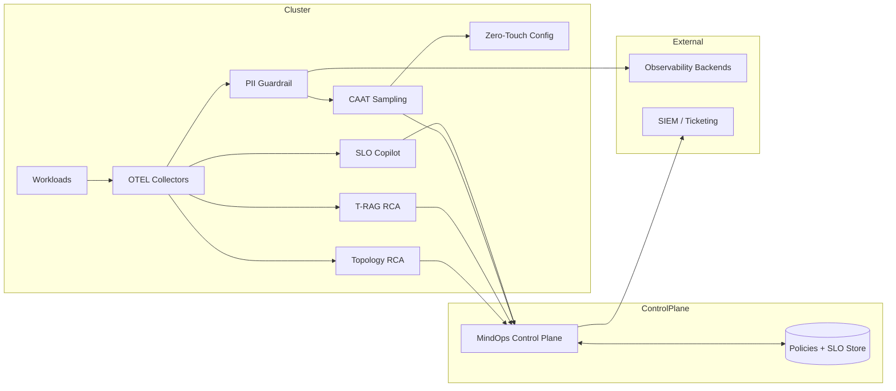

# MindOps Data-Flow Security Model

This document shows how data moves through MindOps, where PII is scrubbed, and what
telemetry leaves the cluster. It is a design-level model intended to guide secure
adoption and vendor integration.

## 1) Data classes

| Data class | Examples | Sensitivity | Handling intent |
| --- | --- | --- | --- |
| Raw telemetry | Logs, spans, metrics | High | Scrub PII before export |
| Derived signals | SLO burn rate, anomaly scores | Medium | Safe to export |
| Policies | Sampling knobs, guardrails | Medium | Export metadata only |
| RCA summaries | Root-cause text, hints | Medium | Export summaries only |
| Topology | Service graph | Medium | Export if sanitized |

## 2) Trust boundaries

| Boundary | Description |
| --- | --- |
| Cluster boundary | Workloads, OTEL collectors, PII guardrail |
| Control plane boundary | MindOps API + stores (policies, SLOs) |
| External boundary | SIEMs, observability backends, ticketing |

## 3) PII scrubbing points

| Stage | Location | Mechanism | Output |
| --- | --- | --- | --- |
| Pre-ingest | PII Guardrail | Regex + detectors | Redacted telemetry |
| Post-ingest | SLO Copilot | Derived metrics only | SLO policies |
| RCA output | T-RAG | Summary-only output | RCA report |

## 4) Data that leaves the cluster

- Redacted telemetry streams (logs/spans/metrics)
- Derived SLO metrics and burn rates
- Sampling policies and guardrail snippets
- RCA summaries and topology hints (no raw PII)

## 5) Reference data-flow

## 6) Recommended enterprise controls

These controls are not enforced by default in this repo, but are recommended for
production deployments:

- TLS for all control plane and exporter endpoints
- RBAC + audit logging on policy changes
- Secret management for exporter credentials
- Namespace-level allow lists for workloads eligible for telemetry
- Signed artifact bundles for SLOs and guardrail policies
