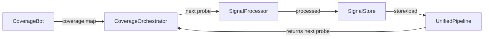
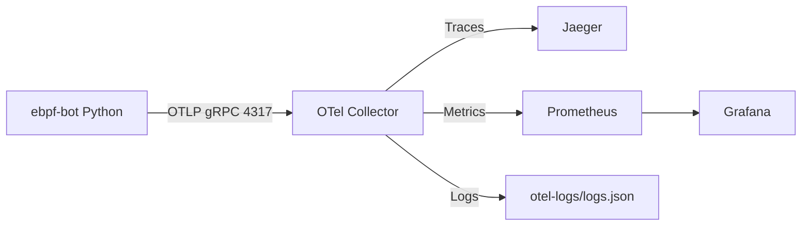

# eBPF Coverage Bot (Project 3)

This project demonstrates an instrumented eBPF coverage bot with end-to-end OpenTelemetry traces, metrics, and logs, plus a local observability stack (Jaeger, Prometheus, Grafana) via Docker Compose.

## What This Project Does

The bot simulates a coverage workflow:

- CoverageBot exposes a coverage map for expected probes.
- CoverageOrchestrator chooses the next probe to target.
- SignalProcessor simulates processing of that probe.
- SignalStore persists the processed result.
- UnifiedPipeline orchestrates the full flow and emits telemetry.

## Architecture



Telemetry pipeline:



## Project 3 Final Report (Condensed)

### Scope Completed

1) OpenTelemetry instrumentation
- Spans across CoverageBot, CoverageOrchestrator, UnifiedPipeline, ProbeInjector, SignalReceiver, SignalProcessor, and SignalStore.
- Span attributes and events for coverage data, orchestrator decisions, and pipeline decisions.
- Unit + E2E tests validate span names, attributes, and trace hierarchy.

2) Metrics and logs emission
- Metrics from pipeline:
  - `ebpf_bot_decisions_total` (counter)
  - `ebpf_bot_decision_latency_ms` (histogram)
  - `ebpf_bot_errors_total` (counter)
- Correlated logs include `trace_id` and `span_id`.
- Demo scripts: `scripts/emit_trace.py` and `scripts/emit_telemetry.py`.

3) OpenTelemetry collector setup
- `otel-collector-config.yaml` defines traces, metrics, logs pipelines.
- Exporters: OTLP to Jaeger, Prometheus, debug + file exporter for logs.
- Log file: `otel-logs/logs.json`.

4) Observability stack (Docker)
- Services: jaeger, otel-collector, prometheus, grafana.
- Grafana provisioned with Prometheus datasource and dashboard.

5) Testing and validation
- Metrics validated via `tests/test_metrics_pipeline.py`.
- Tracing tests and end-to-end assertions in `tests/`.

### Integration Notes

Planned integration references from notes (not present in this repo today):
- `projects/caat` using `UnifiedPipeline` as a subroutine.
- `projects/t-rag` delegating signal collection to `SignalProcessor` and `SignalReceiver`.

If you want these integrations implemented, I can wire them up.

## Quickstart

From `projects/ebpf-bot`:

```bash
docker compose down && docker compose up
python3 scripts/emit_trace.py
```

Endpoints:

- Jaeger UI: http://localhost:16686
- Prometheus: http://localhost:9090
- Collector metrics: http://localhost:8889/metrics
- Grafana: http://localhost:3000 (admin/admin)

Logs are persisted at `projects/ebpf-bot/otel-logs/logs.json`.

## Running Tests

```bash
python3 -m pytest -v tests/test_metrics_pipeline.py
python3 -m pytest -v tests/test_end_to_end_tracing.py
```

Notes:
- Tests set `ENABLE_OTLP=false` to avoid needing a collector.

## Configuration

- `otel-collector-config.yaml` configures OTLP receivers and exporters.
- `docker-compose.yaml` runs the local stack.
- `prometheus.yml` scrapes the collector metrics exporter.
- `grafana/` contains provisioning and dashboards.

## Repository Layout

- `scripts/`: demo scripts to emit telemetry.
- `src/ebpf_bot/`: package implementation.
- `tests/`: unit and integration tests.
- `grafana/`: dashboards and provisioning.
- `otel-logs/`: persisted OTEL logs file.
