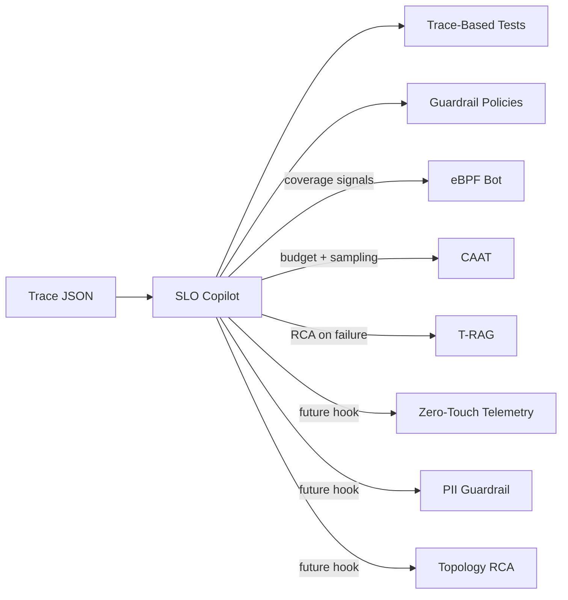

# SLO Copilot + Trace-Based Testing

Project 4 of MindOps focuses on generating, validating, and enforcing service-level objectives (SLOs) using real traces. The SLO Copilot analyzes trace data, proposes SLOs, runs trace-based tests, and emits guardrail snippets that can be used in CI/CD or release gates.

## What this project delivers

- Generate SLOs from trace statistics (latency, error rate, availability).
- Validate SLOs against baseline traces and simulated fault injections.
- Surface coverage gaps via eBPF Coverage Bot integration.
- Feed telemetry recommendations back to CAAT for cost-aware sampling.
- Trigger T-RAG RCA when SLOs fail (optional, uses OpenAI).
- Provide extension points for Projects 5, 6, and 7.

## Architecture (project wiring)



## Directory structure

```
projects/slo-copilot/
├── README.md
├── examples/
│   └── sample_trace.json
├── src/
│   └── slo_copilot/
│       ├── copilot.py
│       ├── cli.py
│       ├── evaluator.py
│       ├── models.py
│       ├── policy_emitter.py
│       ├── slo_generator.py
│       ├── trace_stats.py
│       ├── trace_tests.py
│       └── integrations/
│           ├── caat_adapter.py
│           ├── ebpf_adapter.py
│           ├── trag_adapter.py
│           ├── zero_touch_adapter.py
│           ├── pii_guardrail_adapter.py
│           └── topology_rca_adapter.py
└── tests/
```

## Quickstart

From `projects/slo-copilot`:

```bash
PYTHONPATH=src python3 -m slo_copilot.cli --trace examples/sample_trace.json
```

Minimal CAAT + eBPF demo:

```bash
PYTHONPATH=src python3 -m slo_copilot.demo_cli \
  --trace examples/sample_trace.json \
  --telemetry-volume 0.9 \
  --telemetry-volume 1.1 \
  --expected-signal probe_a \
  --expected-signal probe_b \
  --expected-signal probe_c \
  --observed-signal GET /checkout \
  --observed-signal POST /payment
```

All-in-one demo (CAAT + eBPF + exports + gate):

```bash
PYTHONPATH=src python3 -m slo_copilot.demo_all_cli \
  --trace examples/sample_trace.json \
  --telemetry-volume 0.9 \
  --telemetry-volume 1.1
```

To pass telemetry volumes into the CAAT adapter:

```bash
PYTHONPATH=src python3 -m slo_copilot.cli \
  --trace examples/sample_trace.json \
  --telemetry-volume 0.8 \
  --telemetry-volume 1.1
```

Export SLOs:

```bash
PYTHONPATH=src python3 -m slo_copilot.cli \
  --trace examples/sample_trace.json \
  --export-json exports/slo_export.json \
  --export-openslo exports/openslo.json \
  --export-openslo-yaml exports/openslo.yaml
```

Validate OpenSLO (in-memory or from file):

```bash
PYTHONPATH=src python3 -m slo_copilot.cli \
  --trace examples/sample_trace.json \
  --validate-openslo
```

```bash
PYTHONPATH=src python3 -m slo_copilot.cli \
  --trace examples/sample_trace.json \
  --validate-openslo exports/openslo.json
```

Persist SLOs to a store:

```bash
PYTHONPATH=src python3 -m slo_copilot.cli \
  --trace examples/sample_trace.json \
  --slo-store data/slo_store.json \
  --store-mode merge
```

CI gate (exit 1 on failures):

```bash
PYTHONPATH=src python3 -m slo_copilot.ci_gate \
  --trace examples/sample_trace.json \
  --fail-on any
```

Deployment gate stub:

```bash
PYTHONPATH=src python3 -m slo_copilot.gate_cli \
  --trace examples/sample_trace.json
```

## Integration notes

### CAAT (Project 1)
SLO Copilot calls the CAAT budget engine to forecast telemetry spend and uses the RL policy engine to recommend sampling actions (decrease/maintain/increase). This data is returned in the Copilot report under `telemetry_recommendation`.

### T-RAG (Project 2)
When an SLO fails in baseline or trace-based tests, SLO Copilot can call `t_rag.service.run()` to generate RCA results. This requires the T-RAG dependencies and an `OPENAI_API_KEY`.

### eBPF Bot (Project 3)
SLO Copilot uses the eBPF Coverage Bot to check expected probe coverage, identify missing signals, and suggest instrumentation. Coverage outputs are included in the report and can also be turned into an SLO for coverage ratio.

### Future projects (5, 6, 7)
The `integrations/` stubs provide extension points so that Zero-Touch Telemetry, PII Guardrail, and Topology Graph RCA can be plugged in later without changing the Copilot core.

## Output

The CLI emits a JSON report with:

- `slo_candidates` generated from the trace baseline
- `baseline_evaluations` and `test_results` for trace-based tests
- `coverage` details from the eBPF adapter
- `telemetry_recommendation` from CAAT
- `rca` results from T-RAG (if available)
- `policy_snippets` that can be enforced in deployment gates

## CI gate decision matrix

| Mode | Fails on | Example flag |
| --- | --- | --- |
| `any` | baseline, tests, guardrail | `--fail-on any` |
| `baseline` | baseline violations only | `--fail-on baseline` |
| `tests` | trace-based tests only | `--fail-on tests` |
| `guardrail` | guardrail policy failures | `--fail-on guardrail` |

## Schema and OpenSLO

- JSON schema for the SLO export: `projects/slo-copilot/schema/slo_export.schema.json`
- OpenSLO bundle schema: `projects/slo-copilot/schema/openslo_bundle.schema.json`
- OpenSLO export is a simplified mapping intended for quick integration and includes Service/SLI/SLO resources.
- OpenSLO YAML export is a lightweight serializer for the same resources.

## Next steps

- Replace the in-memory test runner with a real synthetic traffic generator.
- Connect SLO Copilot output to deployment pipelines (eg, canary blockers).
- Add a persistent SLO store (Prometheus or OpenSLO) for long-term tracking.
