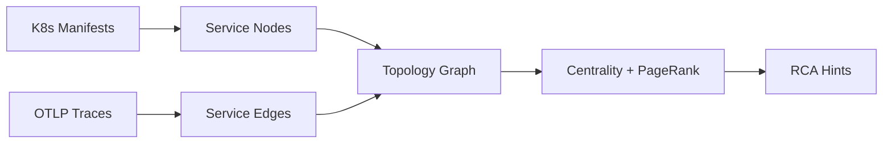

# Topology Graph Root Cause Analysis Engine

Project 7 builds a service topology graph from Kubernetes manifests and trace data, runs
lightweight graph analytics, and surfaces RCA hints based on error rates + topology
centrality.

## What this project delivers

- Ingests K8s manifests and OTLP‑style traces.
- Builds a directed service dependency graph.
- Computes degree centrality + PageRank.
- Ranks likely root causes by error rate + centrality score.
- Exports report JSON and GraphViz DOT.

## Architecture



## Inputs and outputs

| Artifact | Format | Description |
| --- | --- | --- |
| Manifests | YAML/JSON | Deployments/StatefulSets/DaemonSets + Services |
| Traces | JSON | OTLP export or flattened span list |
| Report | JSON | Nodes, edges, metrics, RCA hints |
| Graph | DOT | GraphViz DOT for visualization |

## Scoring heuristic (MVP)

| Component | Weight | Notes |
| --- | --- | --- |
| Error rate | 0.7 | Services with higher error ratios are prioritized |
| PageRank | 0.3 | Central services get a boost |

## Directory structure

```
projects/topology-graph-rca/
├── README.md
├── examples/
│   ├── sample_k8s.yaml
│   └── sample_trace.json
├── requirements.txt
├── src/
│   └── topology_graph_rca/
│       ├── __init__.py
│       ├── analyzer.py
│       ├── cli.py
│       ├── graph.py
│       ├── ingest.py
│       └── models.py
└── tests/
    └── test_analyzer.py
```

## Quickstart

```bash
PYTHONPATH=src python3 -m topology_graph_rca.cli \
  --manifests examples/sample_k8s.yaml \
  --traces examples/sample_trace.json \
  --output out_report.json \
  --output-dot out_graph.dot \
  --output-svg out_graph.svg
```

Note: SVG output requires Graphviz (`dot`) installed.

## Output example

```json
{
  "nodes": [...],
  "edges": [...],
  "metrics": {
    "degree_centrality": {"storefront/checkout": 0.5},
    "pagerank": {"storefront/payments": 0.42},
    "error_rate": {"payments": 1.0}
  },
  "hints": [
    {
      "service": "payments",
      "score": 0.82,
      "notes": ["Error rate 100.00% exceeds threshold."]
    }
  ]
}
```

## Integrations

- **T‑RAG**: Use topology hints to scope RCA context and reduce search space.
- **SLO Copilot**: Correlate SLO violations with graph hotspots.
- **Zero‑Touch Telemetry**: Ensure collector topology aligns with service dependencies.

## Next steps

- Add temporal anomaly scoring (change detection over time).
- Add graph clustering for blast‑radius detection.
- Plug into a persistent graph store (Neo4j, Neptune, ArangoDB).
