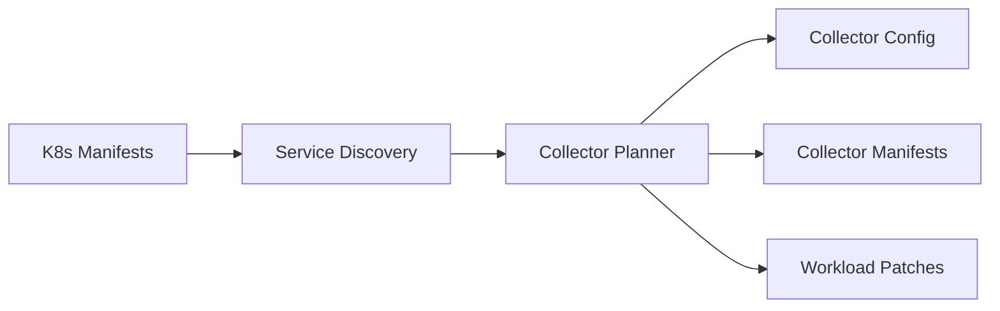

# Zero-Touch Telemetry for Kubernetes

Project 5 automates OpenTelemetry collector setup in Kubernetes. It discovers services from
manifests, selects the right collector mode (gateway, daemonset, or sidecar), and emits
ready-to-apply collector configs/manifests plus instrumentation patches. This removes the
manual work of wiring exporters and sidecars for each service.

## What this project delivers

- Manifest discovery for Deployments/StatefulSets/DaemonSets + Services.
- Auto-planned collector mode (gateway, daemonset, or sidecar).
- Collector config generation with optional sampling policies.
- Instrumentation env var plans and patch hints per workload.
- Outputs in JSON plus Kubernetes YAML manifests.

## Architecture



## Plan outputs

| Artifact | Purpose | File (when `--output-dir`) |
| --- | --- | --- |
| Collector config | OTEL collector configuration | `collector-config.yaml` |
| Collector manifest | K8s Deployment/DaemonSet/ConfigMap | `collector-manifest.yaml` |
| Plan JSON | Full discovery + plan details | `plan.json` |

## Directory structure

```
projects/zero-touch-telemetry/
├── README.md
├── examples/
│   └── sample_k8s.yaml
├── requirements.txt
├── src/
│   └── zero_touch_telemetry/
│       ├── __init__.py
│       ├── cli.py
│       ├── discovery.py
│       ├── language.py
│       ├── manifests.py
│       ├── models.py
│       ├── planner.py
│       └── policy.py
└── tests/
    └── test_discovery.py
```

## Quickstart

From `projects/zero-touch-telemetry`:

```bash
python3 -m venv .venv
source .venv/bin/activate
pip install -r requirements.txt

PYTHONPATH=src python3 -m zero_touch_telemetry.cli \
  --manifests examples/sample_k8s.yaml \
  --mode auto \
  --output-dir out
```

The command writes:

- `out/collector-config.yaml` (collector config)
- `out/collector-manifest.yaml` (k8s manifest)
- `out/plan.json` (discovery + plan details)

## Helm chart

Deploy a collector with Helm (gateway or daemonset):

```bash
helm install ztt deploy/helm/zero-touch-telemetry \
  --set mode=gateway \
  --set collector.exporters[0]=logging
```

Override exporters for OTLP (values file):

```bash
helm install ztt deploy/helm/zero-touch-telemetry \
  -f deploy/helm/zero-touch-telemetry/examples/values-otlp.yaml
```

Override exporters for OTLP (inline):

```bash
helm install ztt deploy/helm/zero-touch-telemetry \
  --set collector.exporters[0]=otlp \
  --set collector.otlpExporterEndpoint=http://otel-collector-gateway.observability:4317 \
  --set collector.samplingRate=0.5
```

Switch to daemonset:

```bash
helm install ztt deploy/helm/zero-touch-telemetry --set mode=daemonset
```

Sidecar mode (config map only for injection):

```bash
helm install ztt deploy/helm/zero-touch-telemetry --set mode=sidecar
```

### Operator CRDs + Instrumentation

The chart ships a minimal Instrumentation CRD and optional Instrumentation resources. Enable with:

```bash
helm install ztt deploy/helm/zero-touch-telemetry \
  --set operator.enabled=true
```

## OpenTelemetry Operator auto-instrumentation

Sample `Instrumentation` CRs and workload annotations live in `deploy/otel-operator/`:

```bash
kubectl apply -f deploy/otel-operator/instrumentation.yaml
```

## Plan → Apply workflow

Generate a plan and apply it to the cluster:

```bash
PYTHONPATH=src python3 -m zero_touch_telemetry.cli \
  --manifests examples/sample_k8s.yaml \
  --mode gateway \
  --output-dir out \
  --apply \
  --diff
```

Diff-only preview (no apply):

```bash
PYTHONPATH=src python3 -m zero_touch_telemetry.cli \
  --manifests examples/sample_k8s.yaml \
  --mode gateway \
  --output-dir out \
  --diff-only
```

Apply a saved plan later:

```bash
PYTHONPATH=src python3 -m zero_touch_telemetry.apply_cli --plan out/plan.json
```

## Configuration

- `--mode auto|gateway|daemonset|sidecar`
- `--namespace observability` (where collector is deployed)
- `--exporter logging` or `--exporter otlp=http://endpoint:4317`
- `--sampling-rate 0.5` (adds a probabilistic sampler)
- `--policy path/to/policy.json` (load CAAT-like sampling actions)

Example policy file:

```json
{
  "sampling_action": "decrease_sampling"
}
```

## Integration notes

### CAAT (Project 1)
The `--policy` flag accepts a sampling policy JSON produced by CAAT. If CAAT outputs
`sampling_action` or `sampling_rate`, Zero-Touch Telemetry applies it in the collector config.

### T-RAG (Project 2)
Zero-Touch Telemetry prepares the OTLP pipeline that T-RAG consumes. Use the `otlp` exporter
flag to forward to a central collector or trace backend that T-RAG can query.

### SLO Copilot (Project 4)
SLO Copilot can reference the Zero-Touch plans to ensure instrumentation coverage and
collector topology matches SLO expectations.

## Output example

```json
{
  "collector": {
    "mode": "gateway",
    "namespace": "observability",
    "sampling_rate": 1.0,
    "exporters": ["logging"],
    "instrumentation": [
      {
        "service_name": "checkout",
        "namespace": "storefront",
        "language": "python",
        "otlp_endpoint": "http://otel-collector-gateway.observability:4317"
      }
    ]
  }
}
```

## Next steps

- Add OpenTelemetry Operator auto-instrumentation support.
- Emit Helm charts for gateway/daemonset deployments.
- Integrate with Project 6 PII Guardrail for pre-ingest sanitization.
